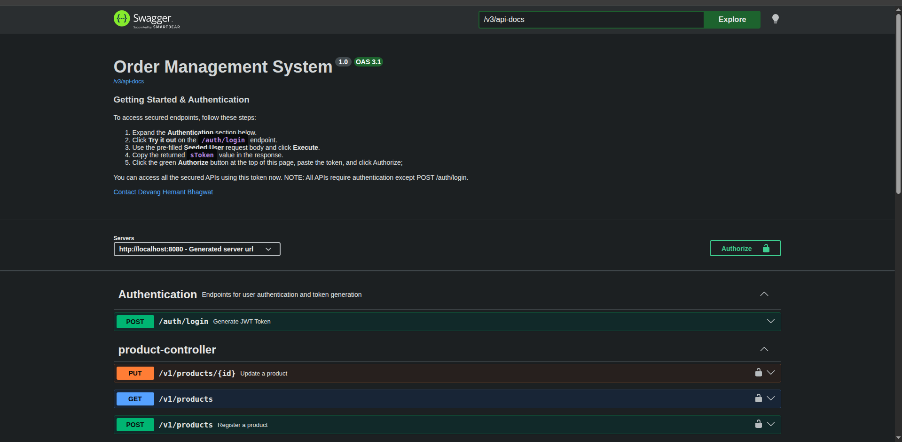
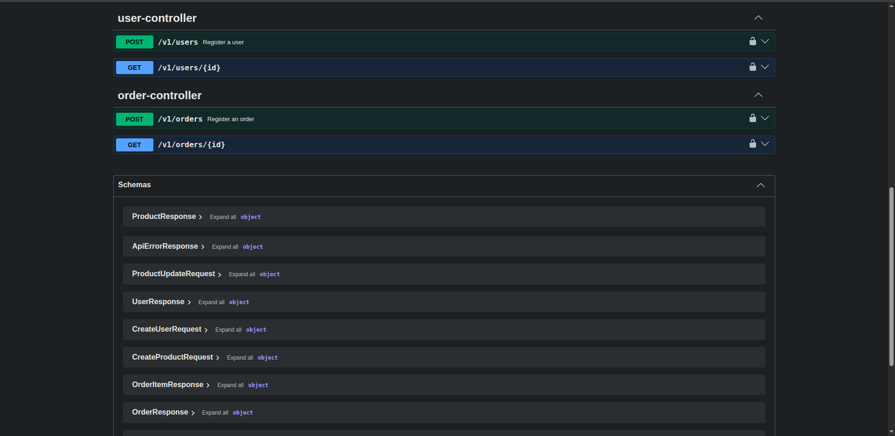
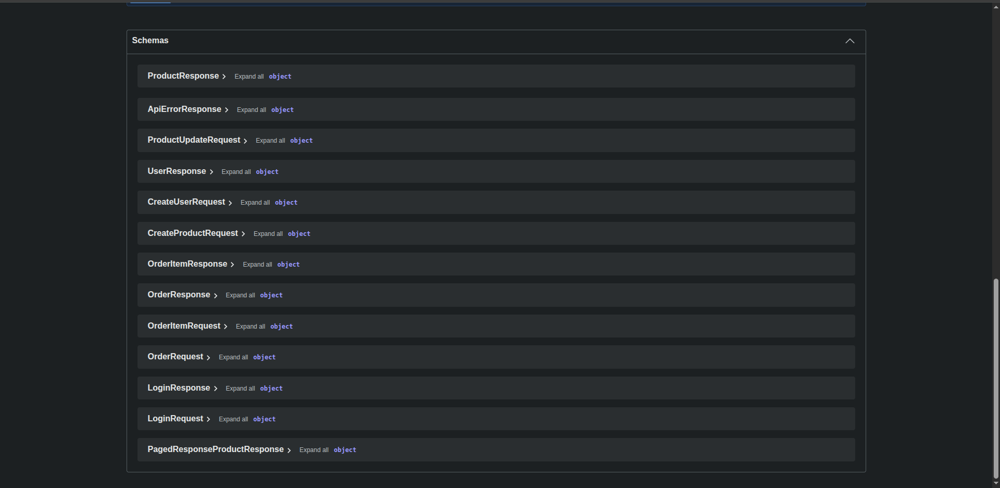

# Order Management System (OMS)

A production-inspired **Order Management System backend** built using **Java 25**, **Spring Boot 4**, and **PostgreSQL**.

This project focuses on building a secure, maintainable, and well-tested backend system while following clean architectural practices.

The application supports:

- JWT Authentication
- Role-Based Access Control (RBAC)
- User Management
- Product Management
- Order Registration
- Stock Validation
- Pagination
- Centralized Exception Handling
- Swagger/OpenAPI Documentation
- Logging
- Automated Testing

Built while surviving Spring Security pain 😵‍💫

---

## Features

### Authentication & Authorization

- JWT-based authentication
- Role-Based Access Control (**ADMIN / USER**)
- Secure API endpoints using Spring Security
- Stateless authentication using Bearer Tokens

### User Management

- Admin-only user registration
- Secure password hashing
- Duplicate username validation

### Product Management

- Register products
- Update product information
- Stock management
- Duplicate product prevention

### Order Management

- Register orders
- Automatic stock deduction
- Inventory validation
- Prevention of negative stock
- Insufficient resource handling

### API Features

- Pagination support
- Centralized exception handling
- Structured error responses
- Swagger/OpenAPI documentation
- Request & response examples

### Quality & Maintainability

- Logging for business and security events
- Automated tests
- Service layer validation
- Repository testing
- Controller validation testing
- Transaction behavior testing

---

## Tech Stack

### Backend

- **Java 25**
- **Spring Boot 4.0.6**
- **Spring Security**
- **Spring Data JPA**
- **Hibernate**

### Database

- **PostgreSQL**

### Documentation

- **Swagger / OpenAPI**

### Build Tool

- **Maven**

### Testing

- **JUnit 5**
- **Mockito**
- **Spring Boot Test**
- **MockMvc**

---

## Architecture Overview

The project follows a layered architecture:

```text
Controller → Service → Repository → Database
````

### Project Structure

```text
src/main/java
├── controller
├── service
├── repository
├── model
├── dto
├── converter
├── security
├── exception
├── config
└── utils
```

### Design Principles

* Separation of concerns
* DTO-based API contracts
* Centralized exception handling
* Service-layer business logic
* Security abstraction using `PrincipalUser`
* Clear API response structure

---

## API Documentation

Swagger UI is available at:

```text
http://localhost:8080/swagger-ui/index.html
```

The API documentation includes:

* Request examples
* Response examples
* Error response examples
* Security requirements
* Endpoint descriptions

---

## Authentication

Authenticate using the login endpoint:

```http
POST /auth/login
```

Example request:

```json
{
  "sUsername": "ADMIN",
  "sPassword": "Admin@123"
}
```

Example response:

```json
{
  "sToken": "JWT_TOKEN"
}
```

Use the returned token in Swagger or API requests:

```http
Authorization: Bearer YOUR_TOKEN
```

---

## Seeded Admin Credentials

The application ships with a seeded admin account for testing.

| Username | Password  | Role  |
| -------- | --------- | ----- |
| ADMIN    | Admin@123 | ADMIN |

These credentials are intentionally exposed for demonstration and testing purposes.

---

## Running the Project

### 1. Clone the repository

```bash
git clone https://github.com/Rust512/order-management-system.git
cd order-management-system
```
## 2.  Running the Project

### Prerequisites

Ensure the following are installed:

* Docker
* Docker Compose

### 1. Clone the repository

```bash
git clone https://github.com/Rust512/order-management-system.git
cd order-management-system
```

### 2. Create the environment file

Copy:

```text
.env.example
```

to:

```text
.env
```

Then update the environment variable values as desired.

Example:

```env
DB_NAME=order_management_system
DB_USERNAME=postgres
DB_PASSWORD=your_password
```

### 3. Start the application

Run:

```bash
docker compose up --build -d
```

> The first build may take a few minutes as Docker downloads dependencies and builds the application image.

Once started, the application will be available at:

```text
http://localhost:8080
```

Logs:

```bash
docker compose logs -f
```

Swagger UI:

```text
http://localhost:8080/swagger-ui/index.html
```

### Seeded Admin Credentials

Use the following credentials to test secured endpoints:

| Username | Password  | Role  |
| -------- | --------- | ----- |
| ADMIN    | Admin@123 | ADMIN |

### Stopping the Application

To stop the containers:

```bash
docker compose down
```

If PostgreSQL volume persistence is enabled, your data will remain intact between restarts.

---

## API Overview

### Authentication

| Method | Endpoint      |
| ------ | ------------- |
| POST   | `/auth/login` |

### Users

| Method | Endpoint    |
| ------ | ----------- |
| POST   | `/v1/users` |

### Products

| Method | Endpoint            |
| ------ | ------------------- |
| POST   | `/v1/products`      |
| PUT    | `/v1/products/{id}` |
| GET    | `/v1/products`      |

### Orders

| Method | Endpoint          |
| ------ | ----------------- |
| POST   | `/v1/orders`      |
| GET    | `/v1/orders/{id}` |

---

## Error Handling

The application provides structured error responses.

Example:

```json
{
  "dStatusCode": 404,
  "sError": "Not Found",
  "sExceptionName": "ResourceNotFoundException",
  "sMessage": "Resource PRODUCT with id matching 5 not found",
  "sPath": "/v1/orders",
  "dtTimeStamp": "2026-05-15T02:36:25.603Z"
}
```

Handled scenarios include:

* Invalid credentials
* Invalid JWT token
* Access denied
* Duplicate resources
* Missing resources
* Insufficient stock
* Validation failures

---

## Testing

The project currently includes:

* Service Tests
* Repository Tests
* Controller Validation Tests
* Transaction Tests
* Security-related test utilities

**Current test count: 45+ tests** ✅

Testing helped catch regressions during refactors — including a logging change that unexpectedly introduced a security context dependency 😄

Run tests using:

```bash
mvn test
```

---

## Logging

The application includes structured logging for:

* Authentication attempts
* Product registration & updates
* Order registration
* Security failures
* Resource lookup failures
* Business rule violations

The logging strategy focuses on:

> logging anomalies and important business/security events instead of execution noise.

---

## Future Improvements

Planned improvements include:

* Dockerization
* Audit Logging
* Product change tracking
* Maker-Checker approval flow
* Kafka integration for asynchronous workflows
* Enhanced observability

---

## Screenshots

### Swagger UI





---

## Author

Developed by:

**Devang Bhagwat**

GitHub:

https://github.com/Rust512

Email:

dbhagwat512@gmail.com

---

## Final Thoughts

This project started as a backend learning exercise and gradually evolved into a production-inspired Order Management System.

Along the way:

* Spring Security fought back
* Logging unexpectedly broke tests
* Annotation jungles appeared
* Tests saved the day

And somehow... it became a backend worth shipping 🚀

```
```
