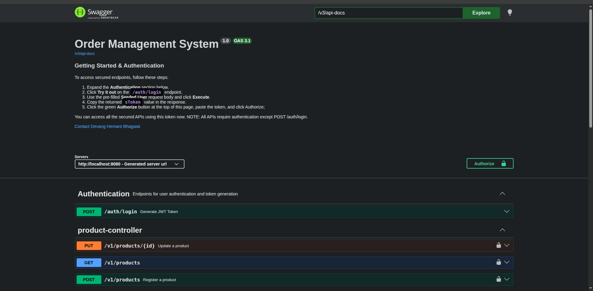

# Order Management System (OMS)

A production-inspired **Order Management System backend** built using **Java 25**, **Spring Boot 4**, and **PostgreSQL**.

This project focuses on building a secure, maintainable, and well-tested backend system while following clean architectural practices.

The application supports:

- JWT Authentication
- Role-Based Access Control (RBAC)
- User Management
- Product Management
- Product audit logs
- Cart management
- Stock Validation
- Pagination
- Centralized Exception Handling
- Swagger/OpenAPI Documentation
- Logging
- Automated Testing

Built while surviving Spring Security pain 😵‍💫

---

## Features

### Authentication & Authorization

- JWT-based authentication
- Role-Based Access Control (**ADMIN / USER**)
- Secure API endpoints using Spring Security
- Stateless authentication using Bearer Tokens

### User Management

- Admin-only user registration
- Secure password hashing
- Duplicate username validation

### Product Management

- Register products
- Update product information
- Stock management
- Duplicate product prevention
- Product audit history

### Order Management

- Add item to cart
- Update cart item quantity
- Remove item from cart
- Order checkout
- Order cancellation
- Inventory validation
- Prevention of negative stock
- Insufficient resource handling

### API Features

- Pagination support
- Centralized exception handling
- Structured error responses
- Swagger/OpenAPI documentation
- Request & response examples

### Quality & Maintainability

- Logging for business and security events
- Automated tests
- Service layer validation
- Repository testing
- Controller validation testing
- Transaction behavior testing

### Tests

- Unit tests
- Integration tests
- Happy-path tests
- Negative tests
- 91% instruction coverage and 100% branch coverage (From JaCoco report)

---

## Tech Stack

### Backend

- **Java 25**
- **Spring Boot 4.0.6**
- **Spring Security**
- **Spring Data JPA**
- **Hibernate**

### Database

- **PostgreSQL**

### Documentation

- **Swagger / OpenAPI**

### Build Tool

- **Maven**

### Testing

- **JUnit 5**
- **Mockito**
- **Spring Boot Test**
- **MockMvc**
- **JaCoCo**

---

## Architecture Overview

The project follows a layered architecture:

```text
Controller → Service → Repository → Database
````

### Project Structure

```text
src/main/java
├── advice
├── config
├── constants
├── converter
├── documentation
├── dto
├── exception
├── factory
├── model
├── repository
├── security
├── service
└── utils
```

### Design Principles

* Separation of concerns
* DTO-based API contracts
* Centralized exception handling
* Service-layer business logic
* Security abstraction using `PrincipalUser`
* Clear API response structure

---

## API Documentation

Swagger UI is available at:

```text
http://localhost:8080/swagger-ui/index.html
```

The API documentation includes:

* Request examples
* Response examples
* Error response examples
* Security requirements
* Endpoint descriptions

---

## Authentication

Authenticate using the login endpoint:

```http
POST /auth/login
```

Example request:

```json
{
  "sUsername": "ADMIN",
  "sPassword": "Admin@123"
}
```

Example response:

```json
{
  "sToken": "JWT_TOKEN"
}
```

Use the returned token in Swagger or API requests:

```http
Authorization: Bearer YOUR_TOKEN
```

---

## Logout

Logout using the endpoint:

```http
POST /auth/logout
```

---

## Seeded Admin Credentials

The application ships with a seeded admin account for testing.

| Username | Password  | Role  |
|----------|-----------|-------|
| ADMIN    | Admin@123 | ADMIN |

These credentials are intentionally exposed for demonstration and testing purposes.

---

## Running the Project

### 1. Clone the repository

```bash
git clone https://github.com/Rust512/order-management-system.git
cd order-management-system
```
## 2.  Running the Project

### Prerequisites

Ensure the following are installed:

* Docker
* Docker Compose

### 1. Create the environment file

Copy:

```text
.env.example
```

to:

```text
.env
```

Then update the environment variable values as desired.

Example:

```env
DB_NAME=order_management_system
DB_USERNAME=postgres
DB_PASSWORD=your_password
```

### 2. Start the application

#### 2.1 Using Docker (Recommended)

Run:

```bash
docker compose up --build -d
```

> The first build may take a few minutes as Docker downloads dependencies and builds the application image.

Once started, the application will be available at:

```text
http://localhost:8080
```

Logs:

```bash
docker compose logs -f
```

Swagger UI:

```text
http://localhost:8080/swagger-ui/index.html

```

#### 2.2 Local development

-  Start postgres container:

```bash
docker compose up postgres-db -d
```
-  Run spring boot app from IntelliJ IDEA using the `dev` profile.

### Stopping the Application

To stop the containers:

```bash
docker compose down
```

The PostgreSQL volume persistence is enabled; your data will remain intact between restarts.

---

## API Overview

### Authentication

| Method | Endpoint       |
|--------|----------------|
| POST   | `/auth/login`  |
| POST   | `/auth/logout` |

### Users

| Method | Endpoint    |
|--------|-------------|
| POST   | `/v1/users` |

### Products

| Method | Endpoint                            |
|--------|-------------------------------------|
| POST   | `/v1/products`                      |
| PUT    | `/v1/products/{id}`                 |
| GET    | `/v1/products`                      |
| GET    | `/v1/products/{id}/audit`           |
| GET    | `/v1/products/{id}/audit/{version}` |

### Orders

| Method | Endpoint                       |
|--------|--------------------------------|
| POST   | `/v1/orders/items`             |
| PUT    | `/v1/orders/items`             |
| DELETE | `/v1/orders/items/{productId}` |
| GET    | `/v1/orders/{id}`              |
| POST   | `/v1/orders/checkout`          |
| DELETE | `/v1/orders`                   |

---

## Cart workflow

### NOTES:

**1. This application ensures that a user can have no more than one orders with status `CREATED` (This will be referred to as a `draft order`).**

**2. Product reserved stock is always greater than zero and less than or equal to the stock**

### 1. Add item to a cart

If a user calls the `POST /v1/orders/items` API, if no draft order exists, a draft order will be created, and the provided order item
will be added to the new draft order.

If a draft order exists, and no order item has the same product ID as provided in the request, a new order item is added to the existing draft order.

If a draft order exists, and an order item with the provided product ID exists, the order item purchase price will be synchronized with the current product price.
Also, the quantity in the existing order item will be increased by exactly the provided quantity in the request body.

### 2. Edit item in cart

This API updates the draft order corresponding to the logged-in user.

If a user calls the `PUT /v1/orders/items` API, the quantity in the order item corresponding to the provided product ID will be updated with the provided quantity
Also, the purchase price will be synchronized with the current product price.

### 3. Remove item from cart

If a user calls the `DELETE /v1/orders/items/{productId}` API, the order item corresponding to the provided product ID will be deleted from the
draft order corresponding to the logged-in user

**Up to this point, only the reserved stock in a product is updated.**

### 4. Checkout order

If a user calls the `POST /v1/orders/checkout` API, the order status of the draft order corresponding to the logged-in user
is updated to `CONFIRMED`.

For all products corresponding to all order items in the draft order, the stock and reserved stock is updated.

stock ← stock - quantity

reserved_stock ← reserved_stock - quantity

### 5. Cancel order

Cancels the user's active draft order.

For all products corresponding to all order items in the draft order, the reserved stock is updated. The stock remains unchanged.

reserved_stock ← reserved_stock - quantity

---

## Error Handling

The application provides structured error responses.

Example:

```json
{
  "dStatusCode": 404,
  "sError": "Not Found",
  "sExceptionName": "ResourceNotFoundException",
  "sMessage": "Resource PRODUCT with id matching 5 not found",
  "sPath": "/v1/orders",
  "dtTimeStamp": "2026-05-15T02:36:25.603Z"
}
```

Handled scenarios include:

* Invalid credentials
* Invalid JWT token
* Access denied
* Duplicate resources
* Missing resources
* Insufficient stock
* Validation failures

---

## Testing

The project currently includes:

* Service Tests
* Repository Tests
* Controller Validation Tests
* Transaction Tests
* Security-related test utilities

**Current test count: 84 tests** ✅

### JaCoCo coverage:
* 91% instruction coverage 😝
* 100% branch coverage 🤩

Testing helped catch regressions during refactors — including a logging change that unexpectedly introduced a security context dependency 😄

Run tests using:

```bash
mvn clean test

```

**How to get the coverage report?**

After running the tests using above steps, open the `target/site/jacoco/index.html` file in a browser.
This opens the JaCoCo test coverage report.

---

## Logging

The application includes structured logging for:

* Authentication attempts
* Product registration & updates
* Product audit history
* Cart operations
* Order checkout
* Cancel order
* Security failures
* Resource lookup failures
* Business rule violations

The logging strategy focuses on:

> logging anomalies and important business/security events instead of execution noise.

---

## Future Improvements

Planned improvements include:

* Token blacklisting using Redis for faster revocation lookups
* Scheduled cleanup for revoked tokens
* Maker-Checker approval for sensitive operations
* Kafka integration for asynchronous workflows and event-driven processing
* Enhanced observability (metrics, structured logging, tracing)
* Rate limiting for authentication and sensitive endpoints
* API caching for read-heavy endpoints
* Email/notification integration for operational workflows

---

## Screenshots

### Swagger UI



---

## Author

Developed by:

**Devang Bhagwat**

GitHub:

https://github.com/Rust512

Email:

dbhagwat512@gmail.com

---

## Final Thoughts

This project started as a backend learning exercise and gradually evolved into a production-inspired Order Management System.

Along the way:

* Spring Security fought back
* Logging unexpectedly broke tests
* Annotation jungles appeared
* Tests saved the day

And somehow... it became a backend worth shipping 🚀

---
